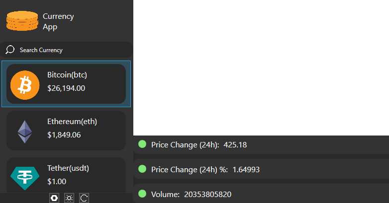

# CryptoCurrencyApp

CryptoCurrencyApp is a multi-page WPF application that uses MVVM and DependencyInjection for maintainability and readability. It provides detailed information about cryptocurrencies and their search using GeckoAPI.

## Features

- **Search Cryptocoins:** Allows you to search for various cryptocurrencies.
- **View Coin Details:** Get detailed information about selected cryptocurrency.
- **Coin Graph:** *(In Progress)* Displays the historical data of the selected cryptocurrency in a graph.
- **Dark/Light Theme:** *(In Progress)* Dark and Light theme based on your preference.
- **Market Click:** *(In Progress)* Market information on click.
- **Strategy Pattern for Fetching Coins:** Allows developers to implement their own way of fetching coins.
- **Regular Updates:** Fetch is being made every 10 minutes to provide the most recent information about the cryptocurrencies.

## Getting Started

1. Clone the repository.
2. Open the solution in Visual Studio.
3. Restore the NuGet packages.
4. Build and run the solution.

## Contributing

Any contribution is welcomed. For major changes, first open an issue to discuss details
